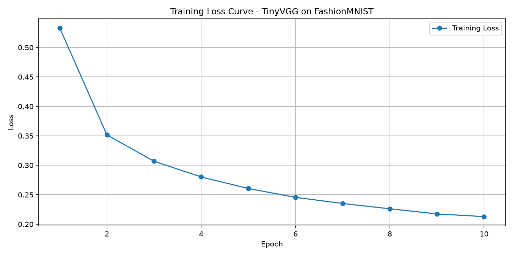
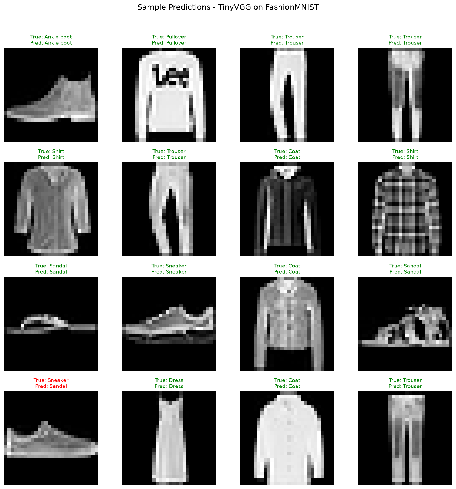

# FashionMNIST Image Classification with PyTorch

A deep learning project that classifies clothing images into 10 categories using a Convolutional Neural Network (TinyVGG) built from scratch in PyTorch. The dataset is loaded directly from raw binary files without using `torchvision`.

---

## Overview

This project implements the full computer vision pipeline:

1. Load raw FashionMNIST IDX files using NumPy and Python's `struct` module
2. Build a custom CNN (TinyVGG) using `torch.nn.Module`
3. Train the model with a complete training/validation loop
4. Evaluate test accuracy
5. Visualize training loss and sample predictions

---

## Dataset: FashionMNIST

FashionMNIST contains **70,000 grayscale clothing images** (28x28 pixels) across 10 categories.

| Label | Class |
|-------|-------|
| 0 | T-shirt/top |
| 1 | Trouser |
| 2 | Pullover |
| 3 | Dress |
| 4 | Coat |
| 5 | Sandal |
| 6 | Shirt |
| 7 | Sneaker |
| 8 | Bag |
| 9 | Ankle boot |

- **Training set:** 60,000 images
- **Test set:** 10,000 images
- **Format:** Raw binary IDX files (no torchvision dependency)
- **Source:** http://fashion-mnist.s3-website.eu-central-1.amazonaws.com/

---

## Project Structure

```
pytorch-cv-project/
├── main.py                  # All code: data loading → model → training → visualization
├── requirements.txt         # Python dependencies
├── .gitignore              # Files excluded from Git
├── README.md               # This file
├── loss_curve.png          # Training loss plot (generated after running)
├── sample_predictions.png  # 16 sample predictions (generated after running)
└── data/
    └── fashionmnist/
        ├── train-images-idx3-ubyte
        ├── train-labels-idx1-ubyte
        ├── t10k-images-idx3-ubyte
        └── t10k-labels-idx1-ubyte
```

---

## Requirements

```
torch
numpy
matplotlib
```

Install with:

```bash
pip install torch numpy matplotlib
```

---

## How to Run

### 1. Download the dataset

Download the 4 raw IDX files from the FashionMNIST website and place them in `data/fashionmnist/`:

```
train-images-idx3-ubyte
train-labels-idx1-ubyte
t10k-images-idx3-ubyte
t10k-labels-idx1-ubyte
```

Make sure the files have **no file extension** (not `.gz`, not `.txt`). If they are still zipped, extract them first.

### 2. Run the project

```bash
python main.py
```

The script will:
- Load and preprocess the data
- Print model architecture and device (CPU or CUDA)
- Train for 10 epochs, printing loss every 100 steps
- Evaluate test accuracy after each epoch
- Save `loss_curve.png` and `sample_predictions.png`

---

## Complete Code: `main.py`


```python
import struct
import numpy as np
import torch
from torch.utils.data import TensorDataset, DataLoader
import torch.nn as nn
import torch.optim as optim
import matplotlib.pyplot as plt
import os

# ---------- CONFIG ----------
DATA_DIR = r"D:\PyTorch Computer Vision\data\fashionmnist"
BATCH_SIZE = 32
EPOCHS = 10
LEARNING_RATE = 0.001
DEVICE = torch.device("cuda" if torch.cuda.is_available() else "cpu")
CLASS_NAMES = [
    "T-shirt/top", "Trouser", "Pullover", "Dress", "Coat",
    "Sandal", "Shirt", "Sneaker", "Bag", "Ankle boot"
]
# ----------------------------

# ---------- LOAD IDX FILES ----------
def load_idx_images(filepath):
    if not os.path.isfile(filepath):
        raise FileNotFoundError(f"File not found: {filepath}")
    with open(filepath, 'rb') as f:
        magic, num, rows, cols = struct.unpack('>IIII', f.read(16))
        images = np.frombuffer(f.read(), dtype=np.uint8)
        images = images.reshape(num, 1, rows, cols)
        images = images.astype(np.float32) / 255.0
    return images

def load_idx_labels(filepath):
    if not os.path.isfile(filepath):
        raise FileNotFoundError(f"File not found: {filepath}")
    with open(filepath, 'rb') as f:
        magic, num = struct.unpack('>II', f.read(8))
        labels = np.frombuffer(f.read(), dtype=np.uint8)
    return labels

train_images_path = os.path.join(DATA_DIR, "train-images-idx3-ubyte")
train_labels_path = os.path.join(DATA_DIR, "train-labels-idx1-ubyte")
test_images_path  = os.path.join(DATA_DIR, "t10k-images-idx3-ubyte")
test_labels_path  = os.path.join(DATA_DIR, "t10k-labels-idx1-ubyte")

print("Loading training data...")
X_train = load_idx_images(train_images_path)
y_train = load_idx_labels(train_labels_path)

print("Loading test data...")
X_test = load_idx_images(test_images_path)
y_test = load_idx_labels(test_labels_path)

print(f"Train: {X_train.shape}, Labels: {y_train.shape}")
print(f"Test:  {X_test.shape}, Labels: {y_test.shape}")

# Convert to PyTorch tensors (using .copy() to avoid UserWarning)
X_train_tensor = torch.from_numpy(X_train.copy())
y_train_tensor = torch.from_numpy(y_train.copy()).long()
X_test_tensor  = torch.from_numpy(X_test.copy())
y_test_tensor  = torch.from_numpy(y_test.copy()).long()

train_dataset = TensorDataset(X_train_tensor, y_train_tensor)
test_dataset  = TensorDataset(X_test_tensor, y_test_tensor)

train_loader = DataLoader(train_dataset, batch_size=BATCH_SIZE, shuffle=True)
test_loader  = DataLoader(test_dataset, batch_size=BATCH_SIZE, shuffle=False)

print(f"Train batches: {len(train_loader)}, Test batches: {len(test_loader)}")

# ---------- MODEL: TinyVGG ----------
class TinyVGG(nn.Module):
    def __init__(self, input_channels, hidden_channels, output_classes):
        super().__init__()
        self.block1 = nn.Sequential(
            nn.Conv2d(input_channels, hidden_channels, kernel_size=3, padding=1),
            nn.ReLU(),
            nn.Conv2d(hidden_channels, hidden_channels, kernel_size=3, padding=1),
            nn.ReLU(),
            nn.MaxPool2d(kernel_size=2)
        )
        self.block2 = nn.Sequential(
            nn.Conv2d(hidden_channels, hidden_channels, kernel_size=3, padding=1),
            nn.ReLU(),
            nn.Conv2d(hidden_channels, hidden_channels, kernel_size=3, padding=1),
            nn.ReLU(),
            nn.MaxPool2d(kernel_size=2)
        )
        self.classifier = nn.Sequential(
            nn.Flatten(),
            nn.Linear(hidden_channels * 7 * 7, output_classes)
        )

    def forward(self, x):
        x = self.block1(x)
        x = self.block2(x)
        x = self.classifier(x)
        return x

# Create model instance
model = TinyVGG(input_channels=1, hidden_channels=10, output_classes=10)
model.to(DEVICE)

# Loss and optimizer
criterion = nn.CrossEntropyLoss()
optimizer = optim.Adam(model.parameters(), lr=LEARNING_RATE)

print(model)
print(f"Device: {DEVICE}")

# ---------- STEP 3: TRAINING LOOP ----------
def train_one_epoch(epoch):
    model.train()
    running_loss = 0.0
    for batch_idx, (images, labels) in enumerate(train_loader):
        images, labels = images.to(DEVICE), labels.to(DEVICE)
        
        optimizer.zero_grad()
        outputs = model(images)
        loss = criterion(outputs, labels)
        loss.backward()
        optimizer.step()
        
        running_loss += loss.item()
        
        if (batch_idx + 1) % 100 == 0:
            print(f"Epoch [{epoch+1}/{EPOCHS}], Step [{batch_idx+1}/{len(train_loader)}], Loss: {loss.item():.4f}")
            
    avg_loss = running_loss / len(train_loader)
    print(f"Epoch [{epoch+1}/{EPOCHS}] completed. Average Loss: {avg_loss:.4f}")
    return avg_loss

def evaluate():
    model.eval()
    correct = 0
    total = 0
    with torch.no_grad():
        for images, labels in test_loader:
            images, labels = images.to(DEVICE), labels.to(DEVICE)
            outputs = model(images)
            _, predicted = torch.max(outputs.data, 1)
            total += labels.size(0)
            correct += (predicted == labels).sum().item()
            
    accuracy = 100 * correct / total
    print(f"Test Accuracy: {accuracy:.2f}%")
    return accuracy

# Store history for plotting
train_losses = []
test_accuracies = []

# Run the training
for epoch in range(EPOCHS):
    avg_loss = train_one_epoch(epoch)
    accuracy = evaluate()
    train_losses.append(avg_loss)
    test_accuracies.append(accuracy)

print("\nTraining complete!")
print(f"Final Test Accuracy: {test_accuracies[-1]:.2f}%")

# ---------- STEP 4: VISUALIZATION ----------
import matplotlib
matplotlib.use('Agg')

# --- 4A: Plot training loss curve ---
plt.figure(figsize=(10, 5))
plt.plot(range(1, EPOCHS + 1), train_losses, marker='o', label='Training Loss')
plt.xlabel('Epoch')
plt.ylabel('Loss')
plt.title('Training Loss Curve - TinyVGG on FashionMNIST')
plt.legend()
plt.grid(True)
plt.tight_layout()
plt.savefig('loss_curve.png', dpi=150)
plt.close()
print("Saved: loss_curve.png")

# --- 4B: Show sample predictions ---
model.eval()
with torch.no_grad():
    images, labels = next(iter(test_loader))
    images, labels = images.to(DEVICE), labels.to(DEVICE)
    outputs = model(images)
    _, predicted = torch.max(outputs, 1)

images = images.cpu()
labels = labels.cpu()
predicted = predicted.cpu()

fig, axes = plt.subplots(4, 4, figsize=(12, 12))
for i, ax in enumerate(axes.flat):
    if i >= len(images):
        break
    img = images[i].squeeze(0)
    true_label = CLASS_NAMES[labels[i].item()]
    pred_label = CLASS_NAMES[predicted[i].item()]
    color = 'green' if predicted[i] == labels[i] else 'red'

    ax.imshow(img, cmap='gray')
    ax.set_title(f"True: {true_label}\nPred: {pred_label}", color=color, fontsize=9)
    ax.axis('off')

plt.suptitle('Sample Predictions - TinyVGG on FashionMNIST', fontsize=14, y=1.02)
plt.tight_layout()
plt.savefig('sample_predictions.png', dpi=150, bbox_inches='tight')
plt.close()
print("Saved: sample_predictions.png")

print("\nAll done! Check 'loss_curve.png' and 'sample_predictions.png'.")
```

---

## Model Architecture: TinyVGG

```
Input: (1 x 28 x 28) grayscale image

Block 1:
  Conv2d(1 -> 10, kernel=3, padding=1) -> ReLU
  Conv2d(10 -> 10, kernel=3, padding=1) -> ReLU
  MaxPool2d(2)
  Output: (10 x 14 x 14)

Block 2:
  Conv2d(10 -> 10, kernel=3, padding=1) -> ReLU
  Conv2d(10 -> 10, kernel=3, padding=1) -> ReLU
  MaxPool2d(2)
  Output: (10 x 7 x 7)

Classifier:
  Flatten -> Linear(490 -> 10)
  Output: 10 class logits
```

| Design Choice | Reason |
|---------------|--------|
| 3x3 convolutions | Standard filter size, captures local patterns |
| Padding=1 | Preserves spatial dimensions after convolution |
| MaxPool2d(2) | Halves spatial size, adds translation invariance |
| ReLU | Introduces non-linearity |
| CrossEntropyLoss | Standard for multi-class classification |
| Adam optimizer | Adapts learning rate per parameter |

---

## Training Configuration

| Parameter | Value |
|-----------|-------|
| Optimizer | Adam |
| Loss Function | CrossEntropyLoss |
| Learning Rate | 0.001 |
| Batch Size | 32 |
| Epochs | 10 |
| Device | CUDA if available, otherwise CPU |

---

## Results

| Metric | Value  |
|--------|--------|
| Test Accuracy | 90.48% |
| Final Training Loss | 0.21   |

### Training Loss Curve



### Sample Predictions



Green = correct prediction, Red = incorrect prediction.

---

## Key Features

- **No torchvision dependency** — raw IDX files parsed manually with Python's `struct` module
- **Device agnostic** — automatically uses GPU (CUDA) if available, falls back to CPU
- **Modular design** — data loading, model, training, and evaluation are cleanly separated
- **Reproducible** — all hyperparameters documented and configurable at the top of `main.py`

---

## Future Improvements

- Add data augmentation (random rotation, horizontal flip)
- Increase model depth (more conv blocks, batch normalization)
- Experiment with different optimizers (SGD with momentum, RMSprop)
- Add learning rate scheduling
- Extend to a larger dataset (CIFAR-10, custom images)
- Deploy as a web app using Gradio or Streamlit

---

## Author

Ash
